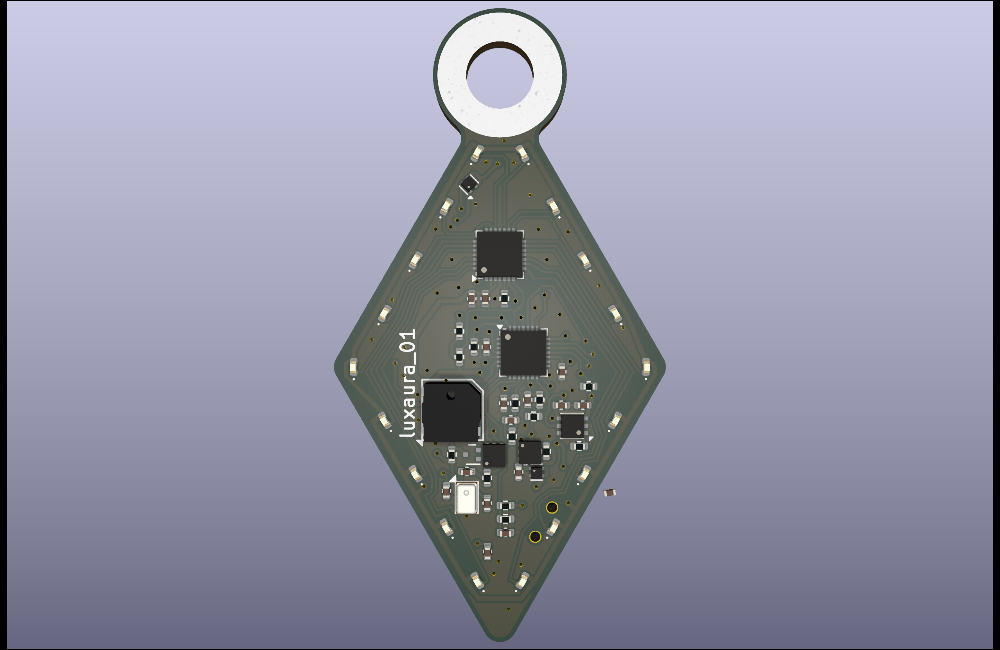
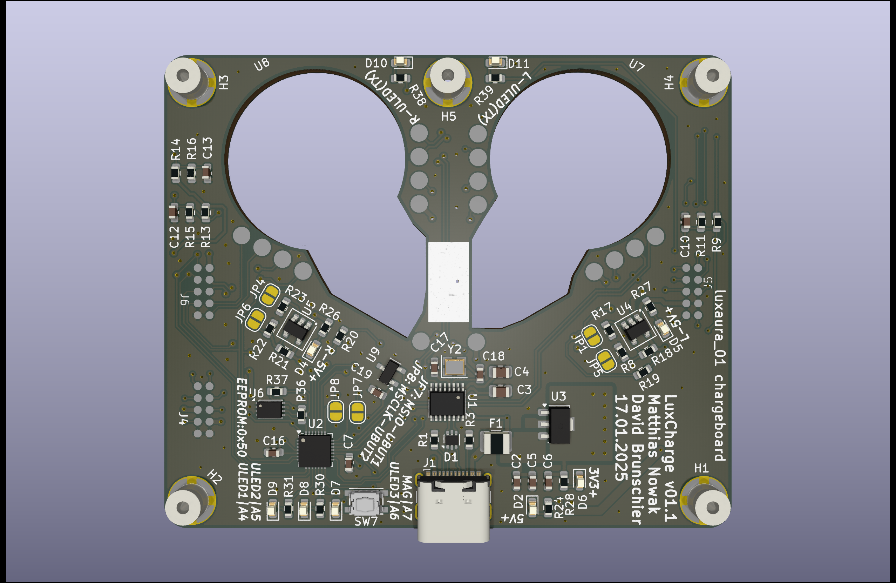

# JewelLED / LuxAura Earring

These stylish earrings have 18 small LEDs on them, which can light up in any pattern. A microphone allows for the potential to sync the patterns up to music. The whole earring is powered off a regular coin cell battery, and can even be used with lithium rechargeable coin cells! It runs around 10-12h at moderate animation load and brightness of a LIR2032 rechargeable Lithium battery

A seperate charging and programming board allows to interface the earrings with your PC, gives you simple access to the programming pin of the earrings and can be used to charge them up if used with lithium rechargeable coin cells.

## Hardware Overview:

### LuxAura 01:

- WCH CH32V203G6U6 microcontroller
- 18 LEDs 0603, single color
- CR2032 battery holder
- optional LIR2032 charging and protection circuit
- Operating at 2.7V, allowing for low battery voltage operation
- 2 buttons and a power switch
- buzzer for audio user feedback
- microphone, which can be used for music detection

### LuxCharge:

- TBD

## Software

Software is currently WIP. The charging board can activate/deactivate 5V charging voltage to the earrings and can rudimentely detect their presence.
The earring software can show basic animations and cycle between them. Test code for microphone sampling is running, but currently beat detection doesnt work.

## Ressources and other notes

- Images, schematics and PCB plots can be found in the "res" folder.
- Development is published here, issues are used for internal issue and project tracking. Feel free to contribute
- The PCBs can be ordered through Turnkey PCBA providers like JLCPCB.

## License

The attached LICENSE.md file contains information about the license.